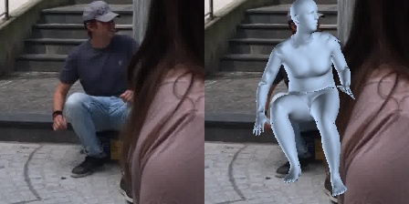
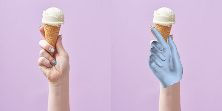

# Quick Demo 
We provide demo codes for end-to-end inference here. 

Our inference codes will iterate all images in a given folder, and generate the results.

## Important notes

 - **This demo doesn't perform human/hand detection**. Our model requires a centered target in the image. 
 - As **Mesh Graphormer is a data-driven approach**, it may not perform well if the test samples are very different from the training data. We observe that our model does not work well if the target is out-of-the-view. Some examples can be found in our supplementary material (Sec. I Limitations).

## Human Body Reconstruction 

This demo runs 3D human mesh reconstruction from a single image. 

Our codes require the input images that are already **cropped with the person centered** in the image. The input images should have the size of `224x224`. To run the demo, please place your test images under `./samples/human-body`, and then run the following script.


```bash
python ./src/tools/run_gphmer_bodymesh_inference.py 
       --resume_checkpoint ./models/graphormer_release/graphormer_3dpw_state_dict.bin 
       --image_file_or_path ./samples/human-body
```
After running, it will generate the results in the folder `./samples/human-body`

  

## Hand Reconstruction 

This demo runs 3D hand reconstruction from a single image. 

You may want to provide the images that are already **cropped with the right-hand centered** in the image. The input images should have the size of `224x224`. Please place the images under `./samples/hand`, and run the following script.

```bash
python ./src/tools/run_gphmer_handmesh_inference.py 
       --resume_checkpoint ./models/graphormer_release/graphormer_hand_state_dict.bin 
       --image_file_or_path ./samples/hand
```
After running, it will outputs the results in the folder `./samples/hand`

  


